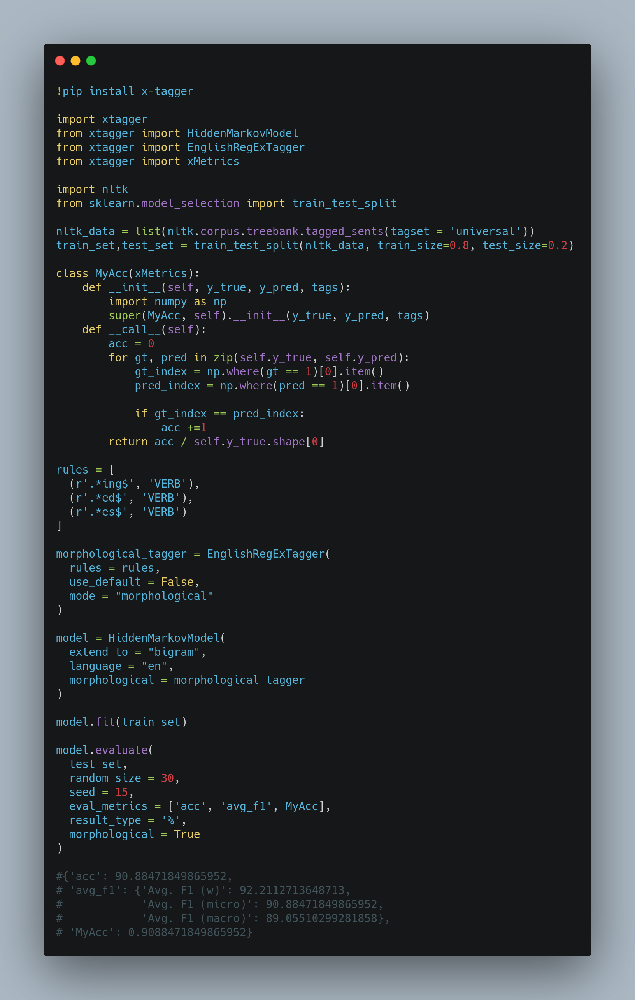

# x-tagger: A Natural Language Processing Toolkit For Sequence Labeling In Its Simplest Form.

<p align="center">
  
</p>

x-tagger is a Natural Language Processing toolkit for sequence labeling in its simplest form. It allows you to play with all kind of data: pandas dataframe, nltk tagged corpus, .txt, torchtext iterator and 🤗 datasets. Due to its data transformations, abstraction and wrapper, you can train almost any kind of sequence labeling model. 

x-tagger has built-in models like Hidden Markov Models (bigram, trigram, deleted interpolation, morphological analyzer, prior support), Long Short-Term Memory (unidirectional, bidirectional) and BERT. While you can train and inference those models with ```.fit()```, x-tagger serves nearly 8 different built-in metrics as well. Besides, if one might want to write custom metrics, x-tagger serves a base class for all kind of metrics!

For gradient based models, we provide a model monitoring and checkpointing class for saving best model and loading them with 2-3 lines of code.

So, what if you want a sequence labeling model but x-tagger does not have it? x-tagger provides a PyTorch Sequence Labeling Wrapper module for your model. Once you have wrote your custom PyTorch model, PyTorchTagTrainer module does everything else!

* There are upcoming features soon:
  * Bidirectional Hidden Markov Models.
  * Maximum Entropy Markov Models (MEMM).
  * Beam search.
  * LSTM-CNN, LSTM-CRF
  * Wrapper for PyTorch models in general.

Remainder: x-tagger is currently in beta release and one-person project.

## Getting started

### Installation

- Using pip:

```bash
pip install x-tagger
```
- Built from source:

```bash
pip install git+https://github.com/safakkbilici/x-tagger
```
### Documentation

[See.](https://github.com/safakkbilici/x-tagger/blob/main/docs/README.md)

### Examples

- [Hidden Markov Models](https://github.com/safakkbilici/x-tagger/blob/main/examples/Hidden%20Markov%20Models.ipynb)
- [Morphological and Prior Support](https://github.com/safakkbilici/x-tagger/blob/main/examples/Morphological%20and%20Prior%20Support.ipynb)
- [Writing Custom Metrics (Matthews Correlation Coefficient)](https://github.com/safakkbilici/x-tagger/blob/main/examples/Writing%20Custom%20Metrics%20(Matthews%20Correlation%20Coefficient).ipynb)
- [Long Short-Term Memory](https://github.com/safakkbilici/x-tagger/blob/main/examples/Long%20Short-Term%20Memory.ipynb)
- [BERT](https://github.com/safakkbilici/x-tagger/blob/main/examples/BERT.ipynb)
- [Model Monitoring and Checkpointing](https://github.com/safakkbilici/x-tagger/blob/main/examples/Model%20Checkpointing.ipynb)
- [x-tagger PyTorchTagWrapper](https://github.com/safakkbilici/x-tagger/blob/main/examples/x-tagger%20PyTorchTagWrapper.ipynb)


## Beautiful Carbon Example

<p align="center">
  
</p>
